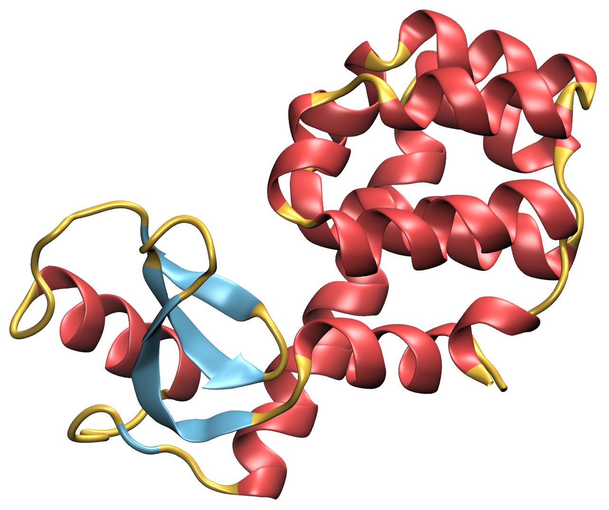

# protein-visual-stuff
Collection of vmd scripts, mdanalysis python code and other helpful ways to visualise protein structures and trajectories

## VMD scripts

### Loading structures 



load_gro_trajectory.tcl usage: 
```
vmd -e script.tcl -args structure.gro trajectory.xtc
```

load_pdb.tcl usage: 
```
vmd -e script.tcl -args pdbfile.pdb
```

## MDAnalysis

### Trajectory analysis 

### Visualisation NGL-view helpers
